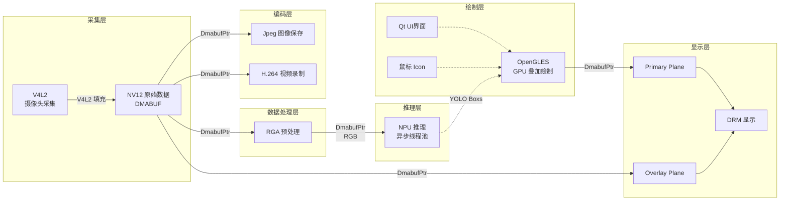

# 🎯 utilsCore

> 面向嵌入式平台的高性能工具库

## 📖 项目简介

utilsCore 是一个面向嵌入式平台（特别是 Rockchip RK356x）的高性能通用工具库，专注于视觉处理和多媒体应用。项目提供了从底层硬件访问到高层应用接口的完整工具链，特别强调性能优化和资源管理，适用于需要高效处理多媒体数据的各种嵌入式应用场景。

### 🎯 核心目标

- ✅ **高性能设计**：通过零拷贝、无锁数据结构、内存池等技术，实现最佳性能
- ✅ **硬件加速集成**：充分利用 RK356x 的硬件加速能力（RGA、MPP、DRM、V4L2）
- ✅ **资源优化**：高效的内存管理、线程池和设备资源管理
- ✅ **模块化设计**：各功能模块解耦，便于灵活组合和扩展

## 🏗️ 系统架构

### 数据流设计



### 关键技术点

- 🔥 **零拷贝传输**：全程使用 DMA-BUF，避免内存复制

- ⚡ **硬件加速**：RGA 进行图像格式转换，MPP 进行视频编码，NPU 进行模型推理

- 🎨 **GPU 渲染**：OpenGL ES + DRM 实现高性能显示

- 🧵 **多线程并行**：异步线程池处理计算密集型任务

  注意：本项目的核心目标为数据链路，模型推理等操作目标是增加负载，用于评估真实应用场景下的性能。

## 📁 目录结构

```
EdgeVision/
├── include/                    # 公共头文件
│   ├── model/                  # 模型推理模块
│   │   ├── yolov5.h           # YOLOv5 模型封装
│   │   ├── rknnPool.h         # RKNN 推理线程池
│   │   ├── preprocess.h       # 图像预处理（RGA 加速）
│   │   └── postprocess.h      # 模型后处理（NMS）
│   │
│   ├── pipeline/               # 流水线控制模块
│   │   ├── appController.h    # 应用主控制器
│   │   ├── visionPipeline.h   # 视觉处理流水线
│   │   ├── displayManager.h   # DRM 显示管理器
│   │   ├── uiRenderer.h       # Qt UI 渲染器
│   │   └── yoloProcessor.h    # YOLO 推理处理器
│   │
│   ├── UI/                     # 用户界面模块
│   │   ├── ConfigInterface/   # 配置界面
│   │   └── rander/            # 渲染核心
│   │
│   └── utils/                  # 工具类库
│       ├── dma/               # DMA-BUF 管理
│       ├── drm/               # DRM 设备控制
│       ├── mpp/               # MPP 编解码
│       ├── rga/               # RGA 图像处理
│       ├── v4l2/              # V4L2 摄像头控制
│       └── sys/               # 系统资源监控
│
├── src/                        # 源文件（对应 include/ 目录结构）
├── examples/                   # 示例代码
│   ├── app.cpp                # 完整应用示例
│   ├── visionTest.cpp         # 视觉流水线测试
│   ├── pipelineTest.cpp       # 流水线功能测试
│   ├── SnowflakeTest.cpp      # DRM 显示测试
│   └── UITest.cpp             # UI 渲染测试
│
├── CMakeLists.txt             # 顶层构建配置
├── rk356x-toolchain.cmake     # RK356x 交叉编译工具链
└── README.md                  # 项目说明（本文件）
```

## 🚀 快速开始

### 环境要求

- **目标平台**：RK356x (ARMv8.2-A)
- **编译环境**：Ubuntu 20.04+ (x86_64)
- **工具链**：GCC 9.0+ (支持 C++14)
- **依赖库**：
  - Rockchip MPP SDK
  - Rockchip RGA SDK
  - libdrm
  - libudev
  - pthread
  - epoll

### 方式一：作为静态库使用

#### 独立构建库文件

```bash
# 1. 克隆项目
git clone https://github.com/SweerItTer/utilsCore.git

# 2. 配置变量
export TOOLCHAIN_PATH=YOUR_TOOLCHAIN_PATH # e.g:~/rk3568/buildroot/output/rockchip_rk3568/host

# 3. 配置并构建
mkdir -p build_utilsCore && cd build_utilsCore
cmake -DCMAKE_BUILD_TYPE:STRING=Release \
    -DCMAKE_EXPORT_COMPILE_COMMANDS:BOOL=TRUE \
    -DCMAKE_TOOLCHAIN_FILE=../utilsCore/rk356x-toolchain.cmake \
    -DTOOLCHAIN_PATH=$TOOLCHAIN_PATH \
    -DUSE_CROSS_COMPILE=ON \
    --no-warn-unused-cli -S ../utilsCore -B .

cmake --build . --target utils -j$(nproc)

# 输出：build/src/utils/libutils.a
```

#### 集成到项目

```cmake
cmake_minimum_required(VERSION 3.14)
project(MyApp)

# 添加头文件路径
include_directories(/path/to/utilsCore/include)

# 链接静态库
link_directories(/path/to/utilsCore/build/src/utils)

add_executable(my_app src/main.cpp)

# 链接库（需要显式添加 pthread）
target_link_libraries(my_app utils pthread)
```

### 方式二：作为 Git 子模块（推荐）

这是最简单、最灵活的方式。源文件就像项目原生文件一样，编译器自动处理依赖。

```bash
# 添加子模块
git submodule add https://github.com/SweerItTer/utilsCore.git third_party/utilsCore
git submodule update --init --recursive
```

**CMakeLists.txt**:
```cmake
cmake_minimum_required(VERSION 3.14)
project(MyApp)

# 添加 utilsCore 子目录
add_subdirectory(third_party/utilsCore)

# 创建可执行文件
add_executable(my_app 
    src/main.cpp
    # 编译器会自动处理依赖
    # 只用到的文件才会被编译
)

# 链接库（需要显式添加 pthread）
target_link_libraries(my_app utils pthread)
```

**优点**：
- ✅ 版本锁定，离线可用
- ✅ 编译器自动处理依赖，只用到的文件才会编译
- ✅ 无需手动选择模块
- ✅ 调试时可以单步进入库代码

### 使用示例

```cpp
#include <utils/v4l2/cameraController.h>
#include <utils/mpp/encoderCore.h>

int main() {
    // 使用V4L2摄像头
    CameraController camera("/dev/video0");
    camera.startCapture();
    
    // 使用MPP编码
    MppEncoderCore encoder;
    encoder.init(1920, 1080);
    
    return 0;
}
```

**编译器行为**：
- 只编译 `cameraController.cpp` 和 `encoderCore.cpp` 及其依赖
- 不会编译其他未使用的源文件（如 `rgaProcessor.cpp` 等）
- 链接时只包含用到的符号，二进制体积自动优化

### 交叉编译

```bash
# 配置环境变量
export SYS_TOOLCHAIN_PATH="/path/to/rk3568/toolchain"

# 配置CMake
mkdir build && cd build
cmake -DCMAKE_BUILD_TYPE=Release \
      -DCMAKE_TOOLCHAIN_FILE=../rk356x-toolchain.cmake \
      -DTOOLCHAIN_PATH=$SYS_TOOLCHAIN_PATH \
      ..
cmake --build . --target utils -j$(nproc)
```

## ⚙️ 功能特性

### 核心功能

| 功能 | 说明 | 技术实现 |
|------|------|----------|
| 📷 摄像头采集 | 支持 V4L2 摄像头，零拷贝 DMA-BUF 传输 | V4L2 + DMA-BUF |
| 🎞️ 视频编码 | H.264/H.265 硬件编码，支持分段录像 | MPP Encoder |
| 📸 拍照功能 | JPEG 格式拍照，支持快速连拍 | MPP JPEG Encoder |
| 🧠 模型推理 | YOLOv5 目标检测，多模型并行推理 | RKNN + 线程池 |
| 🖥️ 显示输出 | DRM 直接显示，支持多图层合成 | DRM |
| 🎨 UI 叠加 | Qt 界面叠加，支持鼠标交互 | Qt5 + OpenGL ES |
| 🎛️ 参数控制 | 曝光、镜像、置信度等参数实时调整 | V4L2 Control |

### 当前性能指标

- *端到端延迟指标* 
- | 延迟  | 样本数(4k@30fps) |
  | ----- | ---------------- |
  | 80ms  | 18               |
  | 90ms  | 3                |
  | 160ms | 3                |
  | 170ms | 4                |
- **最大分辨率**：4K (3840×2160@30fps)
- **推理帧率**：YOLOv5s 15fps
- **内存占用**：< 70MB (4k 场景)

## ⚠️ 已知问题

### 1. 热插拔问题 🔌

**问题描述**：在全功能集成时（UI + Vision Pipeline），热插拔 HDMI 显示器后存在黑屏无法刷新的问题。

**影响范围**：仅影响全功能模式，独立模块运行正常。

**临时解决方案**：重启应用即可恢复。

**根本原因**：DRM 资源刷新时各模块同步机制存在竞态条件。

### 2. 录像问题 📹

**问题描述**：在显示链路开启时，录像功能大概率失效；即使可以录像，也会因为数据竞争问题导致时间轴拉长。

**影响范围**：显示和录像同时使用时。

**临时解决方案**：关闭显示后进行录像。

**根本原因**：DMA-BUF 的多路复用缺乏完善的同步机制。

## 🔮 后续优化路径

### 短期优化

1. **修复热插拔问题**：完善 DRM 资源刷新的同步机制
2. **优化录像功能**：解决数据竞争，确保时间轴准确性
3. **增加错误恢复**：提高系统鲁棒性

### 长期规划

🎯 **ISP 多路并行架构**

当前实现采用 ISP 单入多出模式，后续将重构为真正的并行架构：

```
当前架构（串行）：
摄像头 → ISP → [显示链路] / [推理链路] / [录像链路]

目标架构（并行）：
摄像头 → ISP1 → 显示链路
       → ISP2 → 推理链路
       → ISP3 → 录像链路
```

**优势**：

- ✅ 完全消除数据竞争
- ✅ 各链路独立运行，互不影响
- ✅ 支持不同分辨率和帧率
- ✅ 提高系统整体吞吐量

## 📚 技术栈

### 核心依赖

| 依赖库 | 版本 | 用途 |
|--------|------|------|
| Qt5 | ≥5.12 | GUI 框架和事件循环 |
| OpenCV | ≥4.5 | 图像格式转换和预处理 |
| RKNN-Toolkit | ≥1.7.1 | 模型转换和推理 |
| Rockchip MPP SDK | - | 视频编解码 |
| Rockchip RGA SDK | - | 2D 图像加速 |
| OpenGL ES | 2.0 | GPU 渲染 |
| DRM | - | 显示输出 |
| V4L2 | - | 摄像头采集 |

### 系统依赖

- Linux Kernel 5.10+
- libdrm 2.4+
- libudev
- pthread
- epoll

## 📖 文档

- **API 相关**：详见 [API Wiki](./api_wiki.md)
- **部署指南**：参考 `mount.md`
- **示例代码**：查看 `examples/` 目录

## 🤝 贡献指南

欢迎提交 Issue 和 Pull Request！

## 📄 许可证

Apache License 2.0 | 详见 [LICENSE](LICENSE)

## 👨‍💻 作者

[SweerItTer](https://github.com/SweerItTer)

[xxxzhou.xian@gmail.com](mailto:xxxzhou.xian@gmail.com)

## 🙏 致谢

感谢 Rockchip 提供的硬件加速 SDK 和开源社区的支持。

---

**注意**：本项目专注于传输链路的设计与实现，不包含所有附加功能的鲁棒性保证。后续将通过 ISP 多路并行架构实现真正的并行处理，彻底解决当前的数据竞争问题。